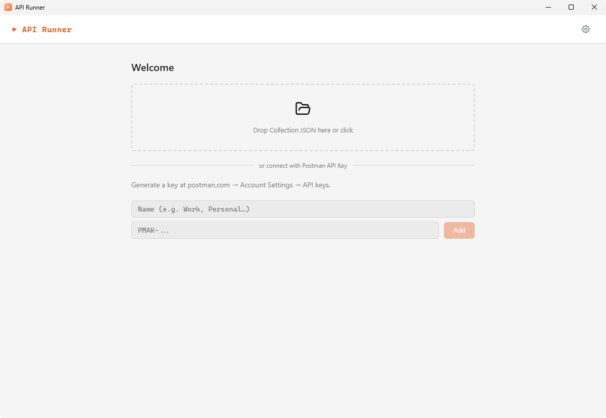
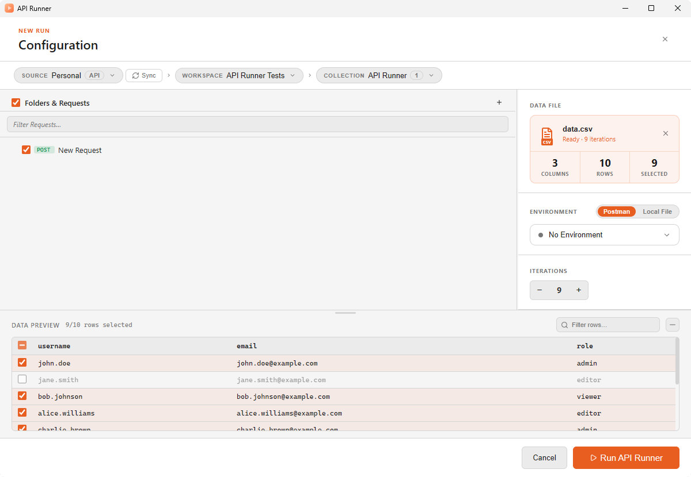
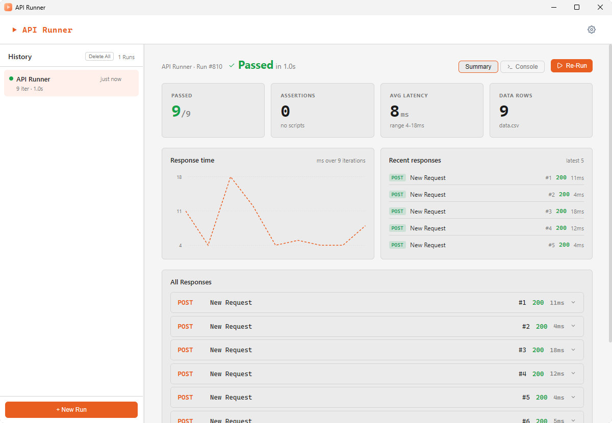

<div align="center">


# API Runner

**Run Postman collections against test data — directly from your desktop.**

[](https://github.com)
[](https://tauri.app)
[](https://react.dev)
[](https://www.rust-lang.org)
[](LICENSE)

---

*Connect your Postman account, pick a collection, upload a data file — and run.*

</div>

---

## What it does

API Runner lets you execute Postman collections against multiple data rows without leaving your desktop. It connects to your Postman account via API key (or loads local collection files), lets you pick a workspace, collection, and environment, configure run options, and streams live Newman output directly in the app.

**Key features:**

- Connect via Postman API key or load local `.json` collection files
- Browse workspaces, collections, and environments from your Postman account
- Run collections with a CSV/JSON data file (one iteration per row)
- Select specific requests or folders within a collection
- Live console output while Newman runs
- Run summary with pass/fail counts per request
- Run history within the session
- Dark/light theme toggle
- German and English UI (auto-detected)
- Auto-updater built in

---

## Screenshots

| Welcome screen | Configuration | Run summary |
|---|---|---|
|  |  |  |

---

## Prerequisites

| Tool | Version | Purpose |
|------|---------|---------|
| [Rust](https://rustup.rs/) | stable | Tauri backend |
| [Bun](https://bun.sh/) | latest | JS runtime & bundler |
| [Node.js](https://nodejs.org/) | 18+ | Peer dependency for Newman |

> On Windows you also need the [WebView2 runtime](https://developer.microsoft.com/en-us/microsoft-edge/webview2/) (usually already installed).

---

## Getting started

```bash
# 1. Install JS dependencies
bun install

# 2. Build the Newman sidecar binary (required before first run)
bun run build:sidecar

# 3. Start the app in development mode
bun run tauri dev
```

### Build for production

```bash
bun run tauri build
```

The installer is placed in `src-tauri/target/release/bundle/`.

---

## Project structure

```
api-runner/
├── src/                    # React frontend (TypeScript)
│   ├── components/         # UI components
│   ├── hooks/              # Custom React hooks (Newman runner, Postman API, theme)
│   ├── locales/            # i18n strings (de, en)
│   └── types/              # Shared TypeScript types
├── src-tauri/              # Rust/Tauri backend
│   ├── src/                # Rust source
│   └── sidecar/            # Newman runner script (compiled to binary)
└── scripts/
    ├── build-sidecar.ts    # Compiles Newman into a standalone executable
    └── bump.ts             # Version bump helper
```

---

## Configuration

API keys and run settings are persisted locally via `tauri-plugin-store` — nothing is sent anywhere except to the Postman API when you explicitly sync.

### Postman API key

1. Open the app
2. Click **Add API Key** and paste your [Postman API key](https://web.postman.co/settings/me/api-keys)
3. The app syncs your workspaces and collections

### Local collections

Use **Open local collection** to load a `.json` file exported from Postman. No API key required.

---

## How the Newman sidecar works

Newman runs as a compiled sidecar binary (`src-tauri/binaries/`). The `build:sidecar` script uses `bun build --compile` to bundle the Newman runner into a self-contained executable named with the Rust target triple (e.g. `newman-runner-x86_64-pc-windows-msvc.exe`). Tauri resolves it via the `bundle.externalBin` config at runtime.

---

## Tech stack

- **[Tauri 2](https://tauri.app/)** — desktop shell (Rust backend + WebView frontend)
- **[React 19](https://react.dev/)** + **[TypeScript](https://www.typescriptlang.org/)** — UI
- **[Newman](https://github.com/postmanlabs/newman)** — Postman collection runner (sidecar)
- **[Vite](https://vite.dev/)** — frontend bundler
- **[i18next](https://www.i18next.com/)** — internationalization
- **[Lucide React](https://lucide.dev/)** — icons

---

## Scripts

| Command | Description |
|---------|-------------|
| `bun run dev` | Start Vite dev server only |
| `bun run tauri dev` | Start full Tauri app in dev mode |
| `bun run build:sidecar` | Compile Newman sidecar binary |
| `bun run tauri build` | Production build + installer |
| `bun run bump` | Bump version in `package.json` + `Cargo.toml` |

---

## License

[MIT License](LICENSE)